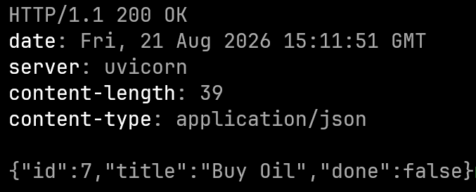
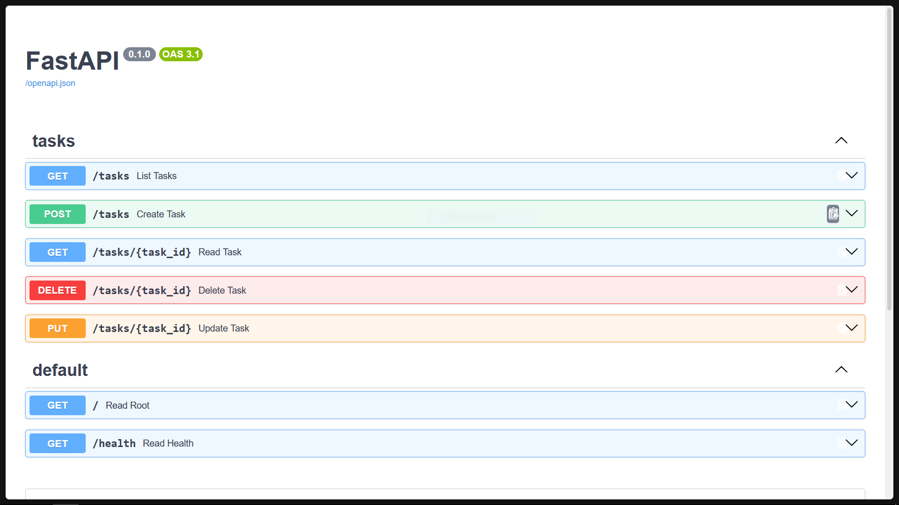
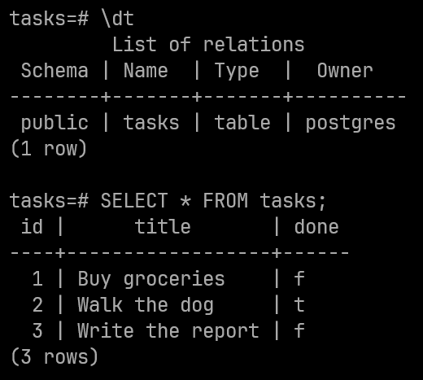

# To-Do List API

A simple CRUD API for a to-do list application built with FastAPI.

## What it does

This API provides endpoints to manage a to-do list:
- List all tasks
- Get a single task by ID
- Create a new task
- Update an existing task
- Delete a task

## What's new in this version

The previous version required installing Python, `uv`, and manually starting the PostgreSQL container before running the app locally. This release **fully Dockerizes the project** -- the entire stack now comes up with a single command:

- **Docker Compose orchestration** (`compose.yaml`) manages both services: the FastAPI app (`api`) and the PostgreSQL 16 database (`db`).
- **Multi-stage `Dockerfile`** based on `python:3.12-slim-trixie`, using the [uv](https://docs.astral.sh/uv/) package manager with a dependency-only cache layer for fast rebuilds.
- **Simplified `run.sh`** -- it now only launches the dev server, bound to `0.0.0.0:8000` so it is reachable through Docker's published port.
- **Environment variables** consolidated into `.env.db`, shared by both containers (previously `.env`).
- **Python requirement** pinned to 3.12.x, matching the container base image.

## Database

This API stores tasks in a **PostgreSQL** database. Both the database and the API itself run as Docker containers, orchestrated by **Docker Compose** (see `compose.yaml`):

- `api` -- the FastAPI application, built from the multi-stage `Dockerfile`
- `db` -- PostgreSQL 16 (image: `postgres:16-trixie`), with data persisted in the `taskdata` volume

Both services share environment variables loaded from a `.env.db` file at the project root. See `.env.example` for the expected variables:

```
POSTGRES_PASSWORD=password
POSTGRES_DB=tasks
DATABASE_URL=postgresql://postgres:password@db:5432/tasks
```

> **Note:** Under Docker Compose the database host must be `db` (the service name) -- not `localhost`. Inside a container, `localhost` refers to the container itself.

**Why PostgreSQL over SQLite?**

- **Concurrency** -- PostgreSQL handles many simultaneous connections efficiently with MVCC, while SQLite serializes writes.
- **Advanced features** -- Full support for JSON columns, full-text search, window functions, CTEs, and more.
- **Scalability** -- Can be scaled to handle large datasets and high throughput workloads.
- **Production standard** -- Battle-tested in production systems worldwide with robust replication and backup tooling.

## Setup & Running

### Prerequisites

- Git
- Docker with Docker Compose v2 (the `docker compose` plugin)

That's it -- no local Python or `uv` installation required; everything runs in containers.

### Quick start

Clone the repository, create your `.env.db`, and start the stack:

```bash
git clone <repo-url>
cd to-do-list-api
cp .env.example .env.db && docker compose up
```

The API will be available at **http://localhost:7777** (port `7777` on the host maps to `8000` inside the container).

### Configuring credentials

Before (or after) starting, edit `.env.db` with your own values:

```dotenv
POSTGRES_PASSWORD=your-password
POSTGRES_DB=tasks
DATABASE_URL=postgresql://postgres:your-password@db:5432/tasks
```

Keep the values consistent: `DATABASE_URL` must use host `db` and embed the same username, password, and database name as the `POSTGRES_*` variables (the username defaults to `postgres`). If you change credentials after the database volume has already been initialized, see [Useful commands](#useful-commands) for how to reset it.

### Useful commands

```bash
docker compose up        # build & run both services (foreground)
docker compose up -d     # run detached in the background
docker compose down      # stop everything (data survives in the taskdata volume)
docker compose down -v   # stop and wipe the database volume (fresh DB next start)
docker compose logs -f api   # tail API logs
docker compose exec db psql -U postgres -d tasks   # inspect the database
```

### Running outside Docker (optional)

If you'd rather develop directly on the host, you'll need Python 3.12 and [uv](https://docs.astral.sh/uv/), plus a reachable PostgreSQL server:

```bash
uv sync
cp .env.example .env    # note: .env, not .env.db -- python-dotenv looks for .env locally
./run.sh
```

Point `DATABASE_URL` in `.env` at whatever PostgreSQL instance you're using. The server starts at `http://localhost:8000`.

## Examples

#### cURL output



#### OpenAPI/SwaggerUI docs



#### Data inside PostgreSQL

A look inside the `db` container using `psql`: `\dt` lists the `tasks` table, and `SELECT * FROM tasks;` shows the rows the API serves (the three seeded tasks created on first use):



Reproduce it yourself with:

```bash
docker compose exec db psql -U postgres -d tasks
```

## API Endpoints

| Method | Endpoint         | Description                      | Response |
|--------|------------------|----------------------------------|----------|
| GET    | `/`              | Root endpoint, lists available routes | JSON     |
| GET    | `/health`        | Health check                     | `{"status": "ok"}` |
| GET    | `/tasks`         | List all tasks                   | `list[TaskRepr]` |
| GET    | `/tasks/{task_id}` | Get a single task by ID        | `TaskRepr` |
| POST   | `/tasks`         | Create a new task                | `TaskRepr` |
| DELETE | `/tasks/{task_id}` | Delete a task by ID             | **204 No Content** |
| PUT    | `/tasks/{task_id}` | Update a task by ID             | `TaskRepr` |

### Request/Response models

**TaskRepr:**
- `id` (int) - Unique identifier
- `title` (str) - Task title
- `done` (bool) - Whether the task is completed

**TaskCreate:**
- `title` (str, required) - Task title. Must not be empty.

**TaskUpdate:**
- `title` (str, optional) - New title. Must not be empty if provided.
- `done` (bool, optional) - New completion status. Mutually exclusive with title in the sense that at least one must be provided.

### Error responses

- **400** - Bad request (e.g., empty title, both fields None in update)
- **404** - Task not found
- **422** - Validation error (FastAPI default, e.g., missing required fields)
